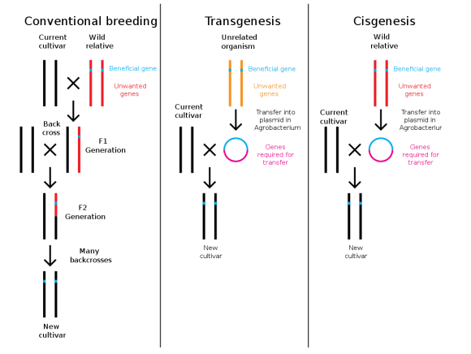

# Markdown Kullanımı 

Bu belgede markdown kullanımının öğretilmesi amaçlanmıştır.

## Üzerinde Durulacak Konular

1. Başlık ekleme
2. Alt başlıkları ekleme
3. Vurgulamalar 
4. Madde ekleme ve sıralama 
5. Bağlantı ekleme
6. Kod ekleme
7. Tablo ekleme
8. Görsel ekleme

### Başlık Ekleme

Markdown kullanırken başlık eklemek amacıyla `#` kullanılır. Örneğin `# Staj` yazıldığı durumda başlık `Staj` şeklinde görünecektir. 

```markdown
# Staj
```

### Alt Başlıklar Ekleme

Başlığın altına alt başlıklar eklenmek isteniyorsa, oluşturulacak her alt başlık için fazladan bir `#` eklenir. Örneğin staj başlığı altında `zorunlu staj 1` yazılması istendiği zaman, bunun `## zorunlu staj 1` şeklinde yazılması gerekir. 

Eğer `zorunlu staj 1` alt başlığının alt başlıkları varsa yazılacak alt başlıklar için fazladan bir `#` daha eklenir. Örneğin bu alt başlıklardan biri `1. gün` olsun. Bunun başlık şeklinde yazılması için `### 1. gün ` şeklinde yazılması gerekir. 

### Vurgulamalar

Markdown kullanırken kelime ya da cümlelerin vurgulanması farklı şekillerde yapılabilir. 

#### Metni Kalın Şekilde Yazma

Kelime veya cümlenin kalın yazılması için;

```markdown 
**kelime** ya da __kelime__
```

Bunun çıktısı şu şekilde görünecektir:

**kelime** ya da __kelime__

#### Metni İtalik Şekilde Yazma

Kelime veya cümlenin italik yazılması için;

```markdown
*kelime* ya da _kelime_ 
```

şeklinde yazılması gerekir. 

Bunun çıktısı şu şekilde görünecektir:

*kelime* ya da _kelime_

#### Kalın ve İtalik Yazma

Kelime veya cümlenin hem kalın hem italik yazılması için;

```markdown
***kelime*** ya da ___kelime___
```

şeklinde yazılması gerekir.

Bunun çıktısının

***kelime*** ya da ___kelime___

şeklinde yazılması gerekir. 

### Madde Ekleme ve Sıralama

#### Madde Ekleme

Markdown kullanırken madde eklenmesi isteniyorsa satır başına `+` ya da `-` eklemek yeterli olacaktır. Örneğin hücre organellerinin maddeler halinde yazılması isteniyorsa her satır başına `+` ya da `-` konması yeterli olacaktır. 

örneğin; 

```markdown
+ kloroplast
+ mitokondri
+ endoplazmik retikulum...
```

yazıldığı zaman elde edilen çıktı:

+ kloroplast
+ mitokondri
+ endoplazmik retikulum...

şeklinde olacaktır. 

#### Sıralama 

Sıralama yapılırken madde ekleme ile benzer bir mantık yürütülür. bunun için satır başına `1.` yazılırsa sıralama yapılacaktır. 

Örneğin;

```markdown
1. a
2. b
3. c
```

yazıldığı zaman elde edilen çıktı

1. a
2. b
3. c

şeklinde olacaktır. 

###  Bağlantı Ekleme

Markdown kullanılırken bağlantı eklenmesi isteniyorsa 

```markdown
[bağlantı adı](bağlantı)
```

 şeklinde yazılması uygun olacaktır. Örneğin komut satırına 

 ```markdown
 [nature](https://www.nature.com/)
 ```

yazılması durumunda elde edilen çıktı [nature](https://www.nature.com/) şeklinde olacaktır. 

### Kod Ekleme

Markdown kullanırken satır içine kod eklenmesi isteniyorsa

```
`kod`
```

şeklinde yazılması yeterli olacaktır. Bu bize satır içinde `kod` yazımını sağlayacaktır. 

Eğer kod bloğu eklemek istersek şu karakterleri kullanmalıyız:

~~~
```
kod
```
~~~

yazıldığı zaman ekranda yazılan çıktı:

```
kod
``` 

şeklinde olacaktır. 

### Tablo ekleme

Tablo eklerken aşağıdaki girdinin çıktısı tablodaki gibi oalcaktır. 

```markdown
|    |  x   |  y   |
|----|:-----|-----:|
|a   |  dld |  sls |
|b   |  hkh |  tyt |
```

|    |  x   |  y   |
|----|:-----|-----:|
|a   |  dld |  sls |
|b   |  hkh |  tyt |

### Görsel Ekleme

Markdown kullanırken görsel eklenmesi bağlantı ekleme ile benzer bir mantıkla yapılır. bunun için 

```markdown

```

şeklinde yazılması uygun olacaktır. örneğin komut satırına

```markdown

```

yazılması durumunda elde edilecek çıktı


 şeklinde olacaktır. 

## EK Kullanımlar

### Metni Altı çizili yazma

Markdown kullanırken bir metnin altını çizmek için;

```HTML
<u> metin </u>
```

kodu kullanılabilir. 

Örneğin komut satırına `<u> şu an hava güneşli </u>` yazıldığı zaman 

<u> şu an hava güneşli </u>

çıktısı çıkacaktır. 

### Metnin rengini değiştirme

Markdown kullanırken yazı rengini değiştirmek için HTML kullanılabilir. Bunun için komut satırına aşağıdaki kod yazıldığı metinde istenen kelime veya kelime grupları istenen renkle yazılabilir. 

```HTML
<p style="color:...;">text</p>
```
Buna örnek vermek olarak. "Umberto Eco'nun Beş Ahlak Yazısı kitabını şu an okuyorum." cümlesi yeşil renkte yazılsın. Buna göre aşağıdaki komut yazıldığı zaman;

```HTML
<p style="color:green;">Umberto Eco'nun Beş Ahlak Yazısı kitabını şu an okuyorum.</p>
```
çıktısı;

<p style="color:green;">Umberto Eco'nun Beş Ahlak Yazısı kitabını şu an okuyorum.</p> 

şeklinde olacaktır. 

#### Metin rengini kırmızı, yeşil ve mavinin tonlarını karıştırarak yazma (RGB)

Bunun için RGB (red, green, blue) denen format kullanılır. Bunun için komut satırına aşağıdaki komut yazılır. 

```HTML
<p style="color:rgb(red, green, blue);">text</p>
```

Burada red, green, blue yazılan yerlere o renklerin tonları yazılacaktır. Şimdi de "Umberto Eco'nun Beş Ahlak Yazısı kitabını şu an okuyorum" cümlesi bu kod ile yazılsın. bunun için kırmızı renk tonu 21, yeşil renk tonu 23, mavi renk tonu da 26 olsun. Öyleyse komut satırına;

```HTML
<p style="color:rgb(21, 115, 130);">Umberto Eco'nun Beş Ahlak Yazısı kitabını şu an okuyorum.</p>
```

yazıldığı zaman bunun çıktısı;

<p style="color:rgb(21, 115, 130);">Umberto Eco'nun Beş Ahlak Yazısı kitabını şu an okuyorum.</p>

şeklinde olacaktır. 

### görüntü boyutunu ayarlama

Markdown'da görüntülerin boyutunu değiştirmek için HTML '' etiketi kullanılabilir. ilgili görüntü eklenirken `width` ve `height` özniteliklerini belirterek boyut ayarlanır. Bunun için aşağıdaki kod yazılarak görüntü boyutu istenen şekilde ayarlanır. 

```HTML


```

Örneğin projeye yüksekliği 234, genişliği 148 olan bir fotoğraf eklendiği zaman komut satırına;

```HTML 

```

yazıldığı zaman bunun çıktısı;


şeklinde olacaktır. 

### Görüntüyü ortalama

Markdownda bir görüntüyü ortalamak için HTML kullanılır. Bunun için komut satırına;

```HTML
<p align="center"></p>
```
şeklinde bir kod yazılmalıdır. Bunun sonucu olarak resim sayfanın ortasında hizalanmış olur. Bunu bir örnekle pekiştirmek gerekirse komut satırına;

```HTML
<p align="center"></p>
```

yazıldığı zaman bunun çıktısı;

<p align="center"></p>

şeklinde olacaktır. 

Şimdi de bu görsel hem ortada hizalansın hem de görsel boyutunda bir değişiklik olsun. Bunun için iki kodu birleştirmek mümkündür. Örneğin görselin yüksekliği 500, genişliği de 650 olsun. Bunun için komut satırına

```HTML
<p align="center"></p>
```
yazıldığı zaman bunun çıktısı;

<p align="center"></p>

şeklinde olacaktır. 


